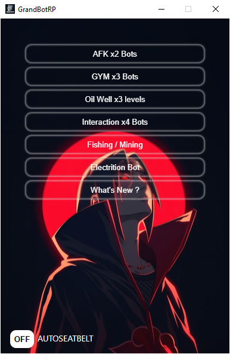
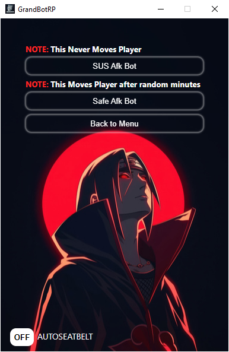
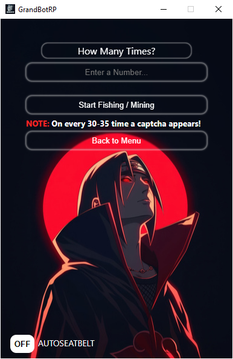

# GrandBotRP

GrandBotRP is a desktop automation bot built using Python. It provides a graphical interface for automating various in-game tasks such as AFK, gym, oil well, and interaction and many more bots.

## Features

- AFK Bots: Automate AFK actions with different modes.
- Gym Bots: Automate gym tasks with customizable repetitions.
- Oil Well Bots: Automate oil well jobs at multiple levels.
- Interaction Bots: Automate medkit and hello tasks.
- Fishing&Mining: Automate you fishing & Mining tasks.
- Electrition Bot: Hold down the `E` Key for you.
- Auto Seatbelt : Automatically fasten your seatbelt.
- Modern UI: clean and user-friendly interface.

# 👉[ Download Here v1.1](https://grandbotrp.rf.gd) 👈

## Screenshots

# 👉[ Download Here v1.1](https://grandbotrp.rf.gd) 👈

## How To Use?

1. Run `main.exe`.
2. Enter your `key` when prompted.
3. And enjoy your game.

## File Structure

- `main.exe` - Main application.

## License

This project is licensed under the MIT License. See LICENSE for details.

---

Made by [Lovelak](https://lovelak.rf.gd)
